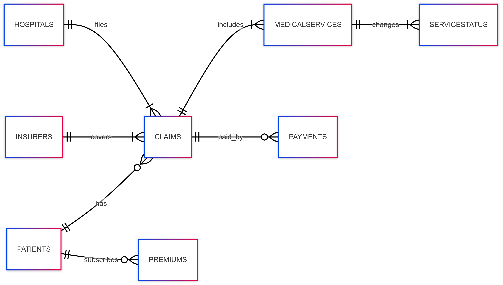

# design document

By Eylaf Mahdi

Video overview: https://youtu.be/zsweowFHykY

## Scope

The database for the Healthcare Insurance Management System includes all entities necessary to facilitate the process of tracking patients, their premium payments, and their insurance claims. As such, included in the database’s scope is:
* patients, include basic identifying information
* insurers, include basic information about the insurer
* hospitals, including the hospitals where the claims come
* claims, include information about each cliam patients submit like date and status
* medicalService, include all the medical check ups per each claim with their prices
* serviceStatus, include the status of each service and the reason explaining the status
* payments, include the total amount covered by the insurer per claim
* premium, include the frequency and amount each patient pay

This project explicitly excludes the consideration of payment methods, the underlying reasons for medical checkups, and any legal processes related to disputes.

## Functional Requirements

 This database will support:

* CRUD operations for all tables.
* Tracking all claims of patients submissions, including all medical services associated with a claim, including multiple updates for each service.
* Calculating and tracking premium payments, out-of-pocket expenses, and covered amounts per claim.
* Adding additional information or reasons

Note: In this iteration, the system does not support partial payments being split across multiple premium records or patients modifying past claims.

## Representation

Entities are captured in SQLite tables with the following schema.

## Entities

The database includes the following entities:
### patients

The ‘patients’ table include:

* `id`, which specifies the unique ID for the patient as an `INTEGER`. This column thus has the `PRIMARY KEY` constraint applied.
* `first_name`, which specifies the patient's first name as `TEXT`, given `TEXT` is appropriate for name fields.
* `last_name`, which specifies the patient's last name. `TEXT` is used for the same reason as `first_name`.
* `gender`, which specifiy the patient’s gender. `TEXT` is used for the same reason as `first_name` , and can only store either `F` or `M`.
* `age`, which identifies the age of the patients and it is of type affinity  `INTEGER`.
* `country`, which inform the origin of a patient beacuse patients go to hospitals even if they are not locals.  `TEXT` is used for the same reason as `first_name`.

 All columns are required and hence have the `NOT NULL` constraint applied where a `PRIMARY KEY` or `FOREIGN KEY` constraint is NOT.

### insurers

The ‘insurers’ table include:

*  `id`, which specifies the unique ID for the insurer as an `INTEGER`. This column has the `PRIMARY KEY` constraint applied to ensure uniqueness of each insurer record.

* `insurer_company`, which specifies the name of the insurance company as `TEXT`. Since company names are textual data, `TEXT` is the appropriate data type. This column is required and thus has the `NOT NULL` constraint applied.

### hospitals

The `hospitals` table includes:

* `id`, which specifies the unique ID for the hospital as an `INTEGER`. This column has the `PRIMARY KEY` constraint applied to guarantee that each hospital is uniquely identified in the database.

* `hospital_name`, which records the official name of the hospital as `TEXT`. Every hospital must have a different name, thus, the column has the `UNIQUE` constraint applied, the `NOT NULL` constraint is also applied to this column.

### claims

The `claims` table includes:

* `id`, which specifies the unique ID for the claim submission as an `INTEGER`. This column has the `PRIMARY KEY` constraint applied to ensure uniqueness of each claim.

* `patient_id`, which is the ID of the patient who filed the claim as an `INTEGER`. This column has the `FOREIGN KEY` constraint applied, referencing the `id` column in the `patients` table to ensure data integrity.

* `insurer_id`, which identifies the insurer responsible for handling the claim as an `INTEGER`. This column has the `FOREIGN KEY` constraint applied, referencing the `id` column in the `insurers` table to ensure relational consistency.

* `hospital_id`, which specifies the hospital where the claim originated as an `INTEGER`. This column has the `FOREIGN KEY` constraint applied, referencing the `id` column in the `hospitals` table.

* `submitted`, which records the date on which the claim was submitted. Since claim submission is mandatory, this column is of type `DATE` and has the `NOT NULL` constraint applied.

* `responded`, which specifies the date on which the insurer responded to the claim. This column is of type `DATE` and may contain `NULL` values if no response has yet been issued.

* `overall_status`, which indicates the outcome of the claim. This column is of type `TEXT` and is constrained by a `CHECK` condition to allow only three values: partially approved, rejected, or approved.

* `total`, which specifies the total amount claimed by the patient. This column is of type `NUMERIC` and has the `NOT NULL` constraint applied, as each claim must include a claim amount.

### medicalServices

The `medicalServices` table includes:

* `id`, which specifies the unique ID for the medical service as an `INTEGER`. This column has the `PRIMARY KEY` constraint applied to ensure that each service is uniquely identified.

* `claim_id`, which represents the ID of the claim under which the medical service was provided as an `INTEGER`. This column has the `FOREIGN KEY` constraint applied, referencing the `id` column in the `claims` table to maintain referential integrity between claims and the medical services associated with them.

* `service_type`, which specifies the type of medical service rendered (e.g., consultation, laboratory test, surgery). As a textual descriptor, it is represented as `TEXT`.

* `price`, which indicates the monetary cost of the service as a `NUMERIC` value. This allows for both integer and decimal representations of prices.

All columns in the `medicalServices` table are required and hence should have the `NOT NULL` constraint applied, except where a `PRIMARY KEY` or `FOREIGN KEY` constraint already ensures uniqueness and referential integrity.

### serviceStatus

The `serviceStatus` table includes:

* `id`, which specifies the unique ID for each service status record as an `INTEGER`. This column thus has the `PRIMARY KEY` constraint applied.

* `medicalService_id`, which identifies the medical service to which the status belongs. This column is of type `INTEGER` and has the `FOREIGN KEY` constraint applied, referencing the `id` column in the `medicalServices` table to ensure data integrity.

* `status`, which specifies the current state of the medical service as `TEXT`. To maintain consistency, a `CHECK` constraint is applied, allowing only one of four valid values: 'pending', 'progress', 'rejected', or 'finished', and it is `NOT NULL`.

* `reason`, which provides an optional explanation for the service status, such as the reason for rejection or a note about the progress. This column is of type `TEXT` and is NULLable.

### payments

The `payments` table includes:

* `id`, which specifies the unique ID for each payment as an `INTEGER`. This column has the `PRIMARY KEY` constraint applied to ensure uniqueness of each payment record.

* `claim_id`, which identifies the claim associated with the payment. This column is of type `INTEGER` and has the `FOREIGN KEY` constraint applied, referencing the `id` column in the `claims` table to maintain referential integrity.

* `covered_amount`, which specifies the amount paid by the insurer towards the claim. This column is of type `NUMERIC` and has the `NOT NULL` constraint applied, as every payment must have an associated amount.

### permiums

The `permiums` table includes:

* `id`, which specifies the unique ID for each premium payment as an `INTEGER`. This column has the `PRIMARY KEY` constraint applied to ensure uniqueness.

* `patient_id`, which identifies the patient who made the payment. This column is of type `INTEGER` and has the `FOREIGN KEY` constraint applied, referencing the `id` column in the `patients` table to maintain referential integrity.

* `amount`, which specifies the amount of permium paid by the patient. This column is of type `NUMERIC` amount, and can have `NULL` values when patients have not payed the permium yet.

* `frequency`, which indicates how often the premium is paid. This column is of type `TEXT` and is constrained by a `CHECK` condition to allow only 'yearly' or 'monthly' as valid values, and it is `NOT NULL`.

## Relationships

The below entity relationship diagram describes the relationships among the entities in the database.

As detailed by the diagram:
* one patient can have many or 0 claims and one claim can only be associated with one patient. 0, if the patient has not used his/her insurance yet.
* an insurer can recieve one or many claims, while a claim can has one insurer.
* a hospital can accept one or many claims, while a claim can only be assosiated with one hospital.
* claims include one or many medicalServices while medicalServices have only one claim
* medicalservices consist of one or many services and each service has its own status, each status belong to one medical service.
* a payment covers the total for one claim, while a claim is assosiated with many or 0 payemnt, 0 if the insurer has not paid to the hospital yet.
* a patient pay  0 or many permium, 0 if the patient forgets to pay or any other issues, while the permium is associated with one patient.

## Optimizations

Indexes are created on columns such as `patients.id`, `permiums.patient_id`, `claims.id`, `claims.patient_id`, `claims.insurer_id`,
 `claims.hospital_id`, `claims.total`, `claims.submitted`, `claims.responded`, `claims.overall_status`, `hospitals.id`,
 `medicalServices.claim_id`, `serviceStatus.medicalService_id`, `serviceStatus.status`, `payments.claim_id`, and `payments.covered_amount` because these columns are frequently used in JOINs, filtering, and aggregations, so indexing them improves query performance.

## Limitations
* the claims table allow only one status for a claim. if a claim status has changed it is not recorded.
* the payments table does not include the method of payment, date, or the currency.
* the payments table also does not explain the amount of installment payments or any other related info.
* the permiums table allows null values but not explaining the reason.
* the patients table is missing the job and health condition columns to calculate accurate permium.
